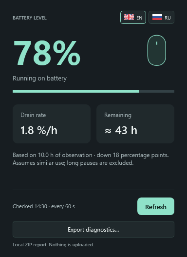
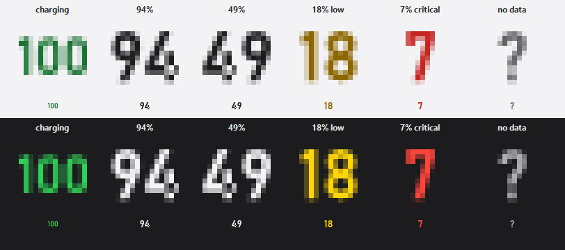
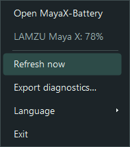

# 🖱️ MayaX-Battery

A Windows battery monitor for the [LAMZU Maya X](https://lamzu.com/products/lamzu-maya-x). It shows the current charge in the notification area and estimates remaining runtime from observed discharge.







The screenshots use demonstration data. They do not show live readings from a connected mouse.

[](https://github.com/0xLaileb/Lamzu.MayaX-Battery/actions/workflows/ci.yml)
[](global.json)
[](LICENSE)

## Contents

- [Features](#features)
- [Getting started](#getting-started)
- [Usage](#usage)
- [How it works](docs/how-it-works.md)
- [Checks](#checks)
- [Project structure](#project-structure)
- [Contributing](#contributing)
- [License](#license)

## Features

| Feature | Details |
| --- | --- |
| Tray battery indicator | Shows the battery percentage with distinct states for low charge, critical charge, charging and unavailable readings. |
| Polling and recovery | Checks about once per minute. After a failed read, it retries after 15 seconds up to four times, then returns to a 60-second interval. |
| Details window | Shows battery status, the last check, polling interval and discharge history. Closing the window keeps the app in the tray. |
| Runtime estimate | Uses readings taken while discharging. An estimate appears after at least 30 minutes and a drop of at least 2 percentage points. Charging periods and long gaps are excluded. |
| English and Russian | Choose `EN` or `RU` with the flag buttons in the window or from the tray menu. The selection applies immediately and is saved locally. By default, the app follows the Windows display language when it is Russian; otherwise it uses English. |
| Local history | Stores observations and language preferences under `%LOCALAPPDATA%\MayaX-Battery`. Existing data under `%LOCALAPPDATA%\MouseBattery` is copied when needed; the original files are preserved. |
| Standalone Windows app | The release is a self-contained, single-file Windows x64 executable. No separate .NET runtime installation is required. |

The project targets the LAMZU Maya X. A battery reading was checked on this model on September 3, 2026. Compatibility with other devices has not been established.

## Getting started

### Requirements

- Windows 10, version 22H2, or Windows 11, x64.
- To build from source: .NET SDK 10.0.401, pinned in `global.json`, with C# 14.
- A LAMZU Maya X mouse or receiver for live readings. The automated checks do not require a connected device.

### Download

Download the latest ZIP from [GitHub Releases](https://github.com/0xLaileb/Lamzu.MayaX-Battery/releases). Extract the archive and run `MayaX-Battery.exe`.

To create a local package from PowerShell at the repository root:

```powershell
.\tools\Build-Release.ps1 -Version 1.0.0
```

The package and its SHA-256 checksum are written to `artifacts/release/`. The script also runs an executable preview check without accessing HID hardware.

## Usage

Start `MayaX-Battery.exe` to open the details window and show the tray icon. Running it again brings the existing window forward. Use `--tray` to start with only the tray icon. Closing the window leaves the app running in the tray. Double-click the tray icon to reopen the window. Right-click it to refresh the reading, select a language, or exit.

### Start automatically on Windows 11

1. Extract the app into a permanent folder, such as `C:\Apps\MayaX-Battery`.
2. Press **Win + R**, enter `shell:startup`, and press **Enter**. This opens the startup folder for your Windows account.
3. Right-click an empty area in that folder and choose **New > Shortcut**.
4. Enter the executable path followed by `--tray`, for example: `"C:\Apps\MayaX-Battery\MayaX-Battery.exe" --tray`.
5. Name the shortcut **MayaX-Battery** and click **Finish**.

The app will start in the tray the next time you sign in. You can double-click the startup shortcut to check that it starts without opening a window. If Windows has disabled it, open **Settings > Apps > Startup** and enable **MayaX-Battery**.

Keep ordinary desktop shortcuts without `--tray` so they open the window. A repeated `--tray` launch leaves the existing window state unchanged. To stop automatic startup, delete the shortcut from `shell:startup`.

Windows controls which tray icons remain visible. To keep the battery indicator visible, open the hidden icons menu (`^`) and drag it onto the notification area. See [Microsoft's taskbar guide](https://support.microsoft.com/en-us/windows/experience/personalization/customize-the-taskbar-in-windows).

## Checks

Build the app and run the hardware-independent checks from PowerShell at the repository root:

```powershell
dotnet build src/MayaX-Battery.csproj -c Release
dotnet run --project tests/Checks.csproj -c Release
```

The checks run as a console program, not through `dotnet test`. GitHub Actions builds the app, runs these checks without a connected mouse, packages the application and smoke-checks the published executable.

## Project structure

| Path | Purpose |
| --- | --- |
| `src/` | Windows tray app, HID access, battery polling, runtime history and details window. |
| `tests/` | Hardware-independent console checks. |
| `tools/` | Release packaging and PowerShell utilities. |
| `docs/` | Screenshots, HID protocol note and [How it works](docs/how-it-works.md). |
| `.github/workflows/` | Continuous integration and release workflows. |
| `AGENTS.md`, `.codex/` | Project guidance and focused development procedures. |

## Contributing

Bug reports and change proposals are welcome through GitHub Issues and Pull Requests. See [CONTRIBUTING.md](CONTRIBUTING.md) for local checks and device compatibility notes.

## License

This project is available under the [MIT License](LICENSE). You may use, modify, distribute and sell the software, provided that the copyright and license notices are retained.