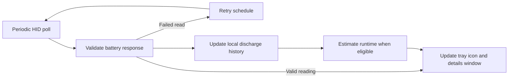
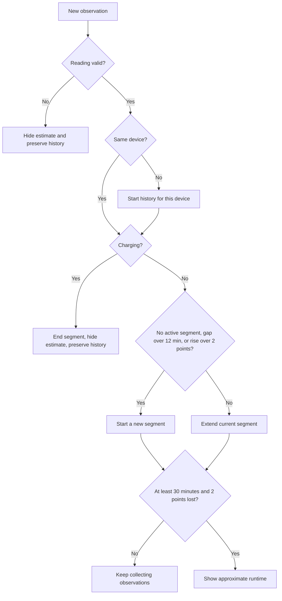

# How it works

MayaX-Battery enumerates present HID interfaces and selects a LAMZU vendor collection with the expected feature report size. It sends a battery-level request, validates the response and retries invalid or empty replies up to four times. A zero percent response is invalid because this protocol uses zero as a no-answer sentinel. The HID report fields and response checks are documented in [the HID protocol note](protocol.md).

Successful readings update the tray icon and details window and are recorded locally. The app normally checks about once per minute. After a failed read, it retries after 15 seconds up to four times, then returns to its regular interval.

The runtime estimate uses successful readings for the same device while it is discharging. Charging or an invalid read hides the estimate while preserving saved history. A gap longer than 12 minutes starts a new segment so time while the device is unavailable or the app is asleep is not counted. The app retains up to 14 days of history. An estimate appears after at least 30 minutes of observations and a drop of at least 2 percentage points. It is an approximation based on prior readings, not a battery-life guarantee.

